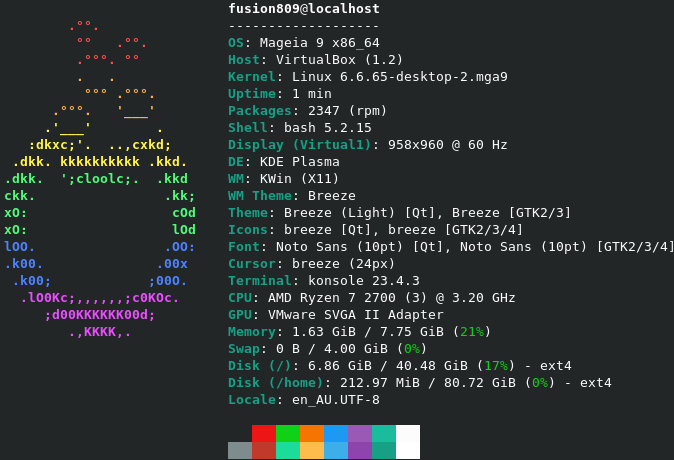
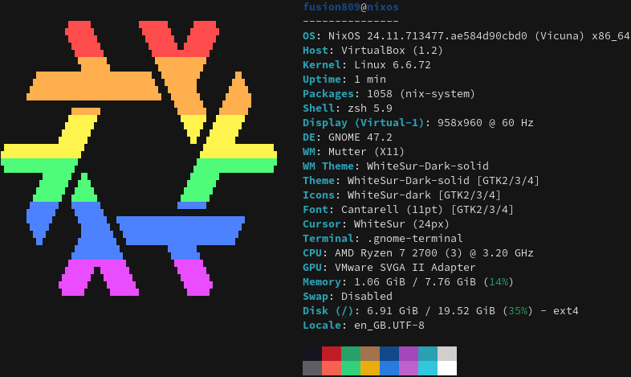
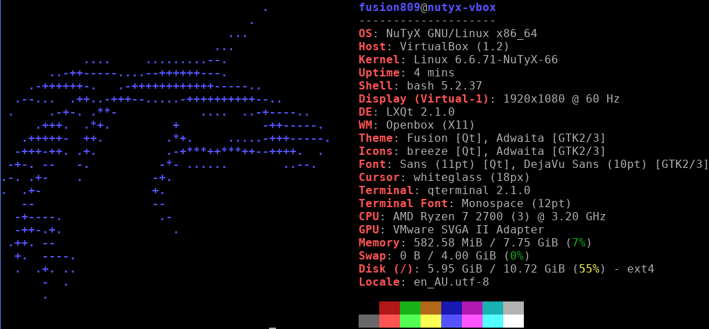
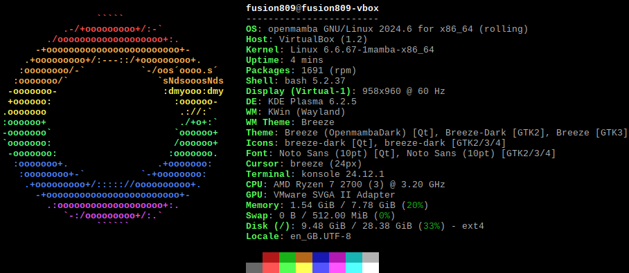
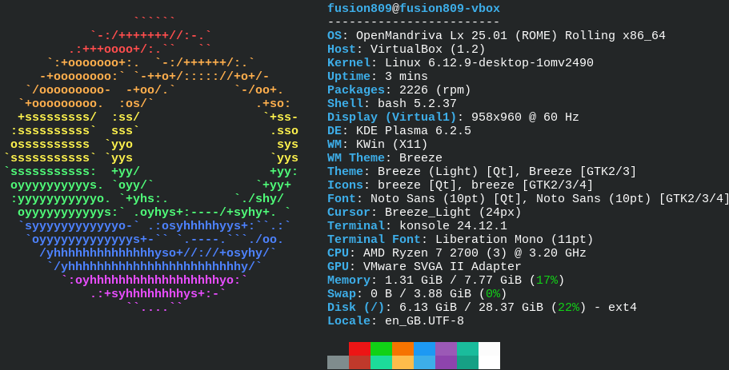
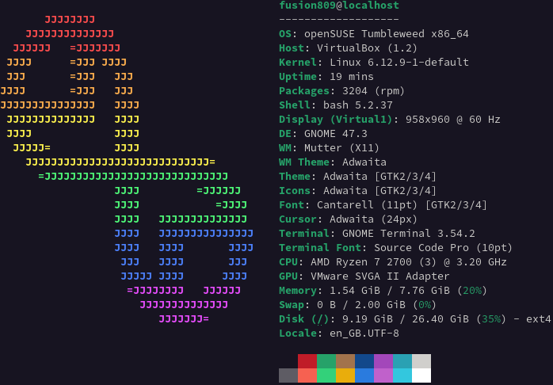
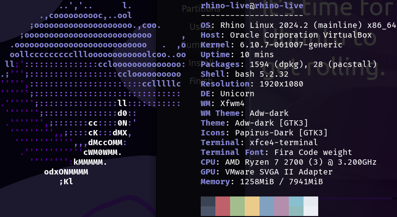
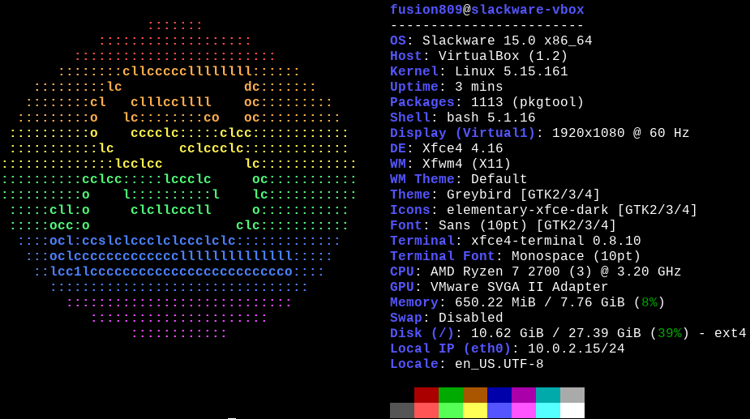

@def title="Linux distributions for experienced users: identifying the ideal use cases."
@def date=2026-01-01
@def tag=["Linux"]

My name is Brenton Horne and I have been using Linux on and off since 2012, including several years in which I used various distributions as my daily driver. These distributions include, among others: Arch Linux, Debian, Fedora, Funtoo Linux, Gentoo Linux, Linux Mint, Mageia, Manjaro Linux, NixOS, OpenMandriva Lx, openSUSE, Sabayon and Ubuntu. Consequently, I would classify myself as an experienced user, and I wanted to give my opinion about the ideal use case of several Linux distributions geared towards intermediate to advanced users. 

\tableofcontents 

# Arch Linux
<table style="width: 380px; float: right; border-collapse: collapse;">
    <tr>
        <td colspan="2"><image src="Arch_Linux.png"/></td>
    </tr>
    <tr>
        <td style="padding: 5px;">Initial release</td>
        <td style="padding: 5px;">11 March 2002</td>
    </tr>
    <tr>
        <td style="padding: 5px; width: 150px;">Website</td>
        <td style="padding: 5px;"><a href="http://www.archlinux.org/">www.archlinux.org</a></td>
    </tr>
    <tr>
        <td style="padding: 5px;">Release model</td>
        <td style="padding: 5px;"><a href="https://en.wikipedia.org/wiki/Rolling_release">Rolling</a></td>
    </tr>
    <tr>
        <td style="padding: 5px;">Modernity<a href="footnote-1">1</a></td>
        <td style="padding: 5px;">Bleeding edge</td>
    </tr>
    <tr>
        <td style="padding: 5px;">Installer</td>
        <td style="padding: 5px;"><a href="https://wiki.archlinux.org/title/Archinstall">archinstall</a>&mdash;textual installer.</td>
    </tr>
    <tr>
        <td style="padding: 5px;">Package manager (type)</td>
        <td style="padding: 5px;"><a href="https://wiki.archlinux.org/title/Pacman">pacman</a> (binary)</td>
    </tr>
    <tr>
        <td style="padding: 5px;">Packaging file(s)</td>
        <td style="padding: 5px;"><a href="https://wiki.archlinux.org/title/PKGBUILD">PKGBUILD</a>&mdash;shell script.</td>
    </tr>
    <tr>
        <td style="padding: 5px;">Compiler</td>
        <td style="padding: 5px;"><a href="https://en.wikipedia.org/wiki/GNU_Compiler_Collection">GNU Compiler Collection</a> (GCC)</td>
    </tr>
    <tr>
        <td style="padding: 5px;">Init system</td>
        <td style="padding: 5px;"><a href="https://en.wikipedia.org/wiki/Systemd">systemd</a></td>
    </tr>
    <tr>
        <td style="padding: 5px;">C standard library</td>
        <td style="padding: 5px;"><a href="https://en.wikipedia.org/wiki/Glibc">glibc</a></td>
    </tr>
    <tr>
        <td style="padding: 5px;">Userland</td>
        <td style="padding: 5px;"><a href="https://en.wikipedia.org/wiki/GNU">GNU</a></td>
    </tr>
    <tr>
        <td style="padding: 5px;">Shell</td>
        <td style="padding: 5px;"><a href="https://en.wikipedia.org/wiki/Bash_(Unix_shell)">Bash</a> (install), <a href="https://en.wikipedia.org/wiki/Z_shell">Zsh</a> (live).</td>
    </tr>
    <tr>
        <td style="padding: 5px;">Repository size<a href="#footnote-1">1</a></td>
        <td style="padding: 5px;">Vast, if the <a href="https://wiki.archlinux.org/title/Arch_User_Repository">Arch User Repository</a> (AUR) is included.</td>
    </tr>
    <tr>
        <td style="padding: 5px;">Base install<a href="#footnote-2">2</a></td>
        <td style="padding: 5px;">Minimal</td>
    </tr>
    <tr>
        <td style="padding: 5px;">Documentation<a href="#footnote-3">3</a></td>
        <td style="padding: 5px;">Comprehensive</td>
    </tr>
</table>
No conversation about Linux distributions geared towards advanced users would be complete without Arch Linux. It follows a Keep it Simple, Stupid (KISS) design philosophy. I may be biased in its favour as it is my go-to Linux distribution. A base install comes without a graphical user interface and has a pretty minimal array of packages, although the total size of a base install is about 1.7GB. It also has perhaps the most comprehensive documentation and vast repositories of any distribution.

It is ideal for users that:

* Are comfortable with the command line. Those not comfortable with the command line may favour Manjaro Linux.
* Want the freedom to customize their system, but without the desire to compile most components of their system from source. 
* Want the very latest software. On the flip side of this, they should also know how to recover from an update breaking their system.
* Prefer a rolling release model.
* Prefer a fast package manager. pacman is one of the fastest I have ever encountered. 
* May want obscure pieces of software. Packaging on Arch is easy for people familiar with shell script &mdash; the language of the Linux command line &mdash; and with its vast repositories many users do not even need to resort to packaging software for themselves. 
* Do not mind using standard system software like systemd. Users that dislike systemd may prefer Artix Linux. 

<h1 style="clear: both;">Chimera Linux</h1>
<table style="width: 380px; float: right; border-collapse: collapse;">
    <tr>
        <td colspan="2"><image src="Chimera_Linux.png"/></td>
    </tr>
    <tr>
        <td style="padding: 5px;">Initial release</td>
        <td style="padding: 5px;">2021</td>
    </tr>
    <tr>
        <td style="padding: 5px; width: 150px;">Website</td>
        <td style="padding: 5px;"><a href="https://chimera-linux.org/">chimera-linux.org</a></td>
    </tr>
    <tr>
        <td style="padding: 5px;">Release model</td>
        <td style="padding: 5px;"><a href="https://en.wikipedia.org/wiki/Rolling_release">Rolling</a></td>
    </tr>
    <tr>
        <td style="padding: 5px;">Modernity<a href="footnote-1">1</a></td>
        <td style="padding: 5px;">Bleeding edge</td>
    </tr>
    <tr>
        <td style="padding: 5px;">Installer</td>
        <td style="padding: 5px;">Manual&mdash;bootstrapping.</td>
    </tr>
    <tr>
        <td style="padding: 5px;">Package manager (type)</td>
        <td style="padding: 5px;"><a href="https://wiki.alpinelinux.org/wiki/Alpine_Package_Keeper">Alpine Package Keeper</a> (APK) (binary), <a href='https://github.com/chimera-linux/cports'>cports</a> (source)</td>
    </tr>
    <tr>
        <td style="padding: 5px;">Packaging file(s)</td>
        <td style="padding: 5px;"><a href="https://github.com/chimera-linux/cports">template.py</a>&mdash;Python script.</td>
    </tr>
    <tr>
        <td style="padding: 5px;">Compiler</td>
        <td style="padding: 5px;"><a href="https://en.wikipedia.org/wiki/Clang">Clang</a></td>
    </tr>
    <tr>
        <td style="padding: 5px;">Init system</td>
        <td style="padding: 5px;"><a href="https://github.com/davmac314/dinit">Dinit</a></td>
    </tr>
    <tr>
        <td style="padding: 5px;">C standard library</td>
        <td style="padding: 5px;"><a href="https://en.wikipedia.org/wiki/Musl">musl</a></td>
    </tr>
    <tr>
        <td style="padding: 5px;">Userland</td>
        <td style="padding: 5px;"><a href="https://en.wikipedia.org/wiki/FreeBSD">FreeBSD</a></td>
    </tr>
    <tr>
        <td style="padding: 5px;">Shell</td>
        <td style="padding: 5px;"><a href="https://en.wikipedia.org/wiki/Almquist_shell">sh</a></td>
    </tr>
    <tr>
        <td style="padding: 5px;">Repository size<a href="#footnote-1">1</a></td>
        <td style="padding: 5px;">Medium-small</td>
    </tr>
    <tr>
        <td style="padding: 5px;">Base install<a href="#footnote-2">2</a></td>
        <td style="padding: 5px;">Minimal</td>
    </tr>
    <tr>
        <td style="padding: 5px;">Documentation<a href="#footnote-3">3</a></td>
        <td style="padding: 5px;">Minimal</td>
    </tr>
</table>
Chimera Linux is a truly unique Linux distribution. 

<h1 style="clear: both;">CRUX</h1>
<table style="width: 380px; float: right; border-collapse: collapse;">
    <tr>
        <td colspan="2"><image src="CRUX_3.7.png"/></td>
    </tr>
    <tr>
        <td style="padding: 5px;">Initial release</td>
        <td style="padding: 5px;">December 2002</td>
    </tr>
    <tr>
        <td style="padding: 5px; width: 150px;">Website</td>
        <td style="padding: 5px;"><a href="https://crux.nu/">crux.nu</a></td>
    </tr>
    <tr>
        <td style="padding: 5px;">Release model</td>
        <td style="padding: 5px;">Fixed</td>
    </tr>
    <tr>
        <td style="padding: 5px;">Modernity<a href="footnote-1">1</a></td>
        <td style="padding: 5px;">Stable</td>
    </tr>
    <tr>
        <td style="padding: 5px;">Installer</td>
        <td style="padding: 5px;">Manual, with setup script.</td>
    </tr>
    <tr>
        <td style="padding: 5px;">Package manager (type)</td>
        <td style="padding: 5px;">Ports with prt-get (source).</td>
    </tr>
    <tr>
        <td style="padding: 5px;">Packaging file(s)</td>
        <td style="padding: 5px;"><a href="https://crux.nu/Main/Handbook3-7-Package">Pkgfile</a></td>
    </tr>
    <tr>
        <td style="padding: 5px;">Compiler</td>
        <td style="padding: 5px;"><a href="https://en.wikipedia.org/wiki/GNU_Compiler_Collection">GCC</a></td>
    </tr>
    <tr>
        <td style="padding: 5px;">Init system</td>
        <td style="padding: 5px;"><a href="https://en.wikipedia.org/wiki/Init#SysV-style">SysV</a></td>
    </tr>
    <tr>
        <td style="padding: 5px;">C standard library</td>
        <td style="padding: 5px;"><a href="https://en.wikipedia.org/wiki/Glibc">glibc</a></td>
    </tr>
    <tr>
        <td style="padding: 5px;">Userland</td>
        <td style="padding: 5px;"><a href="https://en.wikipedia.org/wiki/GNU">GNU</a></td>
    </tr>
    <tr>
        <td style="padding: 5px;">Shell</td>
        <td style="padding: 5px;"><a href="https://en.wikipedia.org/wiki/Bash">Bash</a></td>
    </tr>
    <tr>
        <td style="padding: 5px;">Repository size<a href="#footnote-1">1</a></td>
        <td style="padding: 5px;">Small</td>
    </tr>
    <tr>
        <td style="padding: 5px;">Base install<a href="#footnote-2">2</a></td>
        <td style="padding: 5px;">Minimal</td>
    </tr>
    <tr>
        <td style="padding: 5px;">Documentation<a href="#footnote-3">3</a></td>
        <td style="padding: 5px;">Minimal</td>
    </tr>
</table>
CRUX aims to keep it simple as it uses tar.gz-based packages, BSD-style init scripts, and has fairly small repositories. It otherwise uses standard Linux system software. CRUX follows a fixed release model with new releases every year or two. It uses source-based package management and is best suited to advanced users that appreciate its idea of simplicity. A base install of CRUX 3.7, with GRUB installed to serve as the bootloader, uses about 2.6GB disk space. 

<h1 style="clear: both;">Debian</h1>
<table style="width: 380px; float: right; border-collapse: collapse;">
    <tr>
        <td colspan="2"><image src="Debian_12.png"/></td>
    </tr> 
    <tr>
        <td style="padding: 5px;">Initial release</td>
        <td style="padding: 5px;">August 1993</td>
    </tr>
    <tr>
        <td style="padding: 5px; width: 150px;">Website</td>
        <td style="padding: 5px;"><a href="https://www.debian.org/">www.debian.org</a></td>
    </tr>
    <tr>
        <td style="padding: 5px;">Release model</td>
        <td style="padding: 5px;">Fixed</td>
    </tr>
    <tr>
        <td style="padding: 5px;">Modernity<a href="footnote-1">1</a></td>
        <td style="padding: 5px;">Stable<a href="footnote-5">5</a></td>
    </tr>
    <tr>
        <td style="padding: 5px;">Installer</td>
        <td style="padding: 5px;"><a href="https://en.wikipedia.org/wiki/Debian-Installer">Debian-Installer</a>&mdash;graphical.</td>
    </tr>
    <tr>
        <td style="padding: 5px;">Package manager (type)</td>
        <td style="padding: 5px;"><a href="https://en.wikipedia.org/wiki/Advanced_Packaging_Tool">Advanced Packaging Tool</a> (APT; binary)</td>
    </tr>
    <tr>
        <td style="padding: 5px;">Packaging file(s)</td>
        <td style="padding: 5px;"><a href="https://wiki.debian.org/Packaging/Intro">Rules (Makefile), control, copyright and changelog files</a></td>
    </tr>
    <tr>
        <td style="padding: 5px;">Compiler</td>
        <td style="padding: 5px;"><a href="https://en.wikipedia.org/wiki/GNU_Compiler_Collection">GNU Compiler Collection</a> (GCC)</td>
    </tr>
    <tr>
        <td style="padding: 5px;">Init system</td>
        <td style="padding: 5px;"><a href="https://en.wikipedia.org/wiki/Systemd">systemd</a></td>
    </tr>
    <tr>
        <td style="padding: 5px;">C standard library</td>
        <td style="padding: 5px;"><a href="https://en.wikipedia.org/wiki/Glibc">glibc</a></td>
    </tr>
    <tr>
        <td style="padding: 5px;">Userland</td>
        <td style="padding: 5px;"><a href="https://en.wikipedia.org/wiki/GNU">GNU</a></td>
    </tr>
    <tr>
        <td style="padding: 5px;">Shell</td>
        <td style="padding: 5px;"><a href="https://en.wikipedia.org/wiki/Bash_(Unix_shell)">Bash</a></td>
    </tr>
    <tr>
        <td style="padding: 5px;">Repository size<a href="#footnote-2">2</a></td>
        <td style="padding: 5px;">Very large</td>
    </tr>
    <tr>
        <td style="padding: 5px;">Base install<a href="#footnote-3">3</a></td>
        <td style="padding: 5px;">Minimal or compete</td>
    </tr>
    <tr>
        <td style="padding: 5px;">Documentation<a href="#footnote-4">4</a></td>
        <td style="padding: 5px;">Detailed</td>
    </tr>
</table>

<h1 style="clear: both;">Exherbo</h1>
<table style="width: 380px; float: right; border-collapse: collapse;">
    <tr>
        <td colspan="2"><image src="Exherbo.png"/></td>
    </tr>
    <tr>
        <td style="padding: 5px;">Initial release</td>
        <td style="padding: 5px;">17 January 2006?<a href="footnote-6">6</a></td>
    </tr>
    <tr>
        <td style="padding: 5px; width: 150px;">Website</td>
        <td style="padding: 5px;"><a href="https://exherbolinux.org/">exherbolinux.org</a></td>
    </tr>
    <tr>
        <td style="padding: 5px;">Release model</td>
        <td style="padding: 5px;"><a href="https://en.wikipedia.org/wiki/Rolling_release">Rolling</a></td>
    </tr>
    <tr>
        <td style="padding: 5px;">Modernity<a href="footnote-1">1</a></td>
        <td style="padding: 5px;">Bleeding edge</td>
    </tr>
    <tr>
        <td style="padding: 5px;">Installer</td>
        <td style="padding: 5px;">Manual&mdash;bootstrapping and compiling.</td>
    </tr>
    <tr>
        <td style="padding: 5px;">Package manager (type)</td>
        <td style="padding: 5px;"><a href="https://paludis.exherbolinux.org/">Paludis</a> (source)</td>
    </tr>
    <tr>
        <td style="padding: 5px;">Packaging file(s)</td>
        <td style="padding: 5px;">ebuild&mdash;shell script with custom commands.</td>
    </tr>
    <tr>
        <td style="padding: 5px;">Compiler</td>
        <td style="padding: 5px;"><a href="https://en.wikipedia.org/wiki/GNU_Compiler_Collection">GCC</a></td>
    </tr>
    <tr>
        <td style="padding: 5px;">Init system</td>
        <td style="padding: 5px;"><a href="https://en.wikipedia.org/wiki/Systemd">systemd</a><a href="footnote-7">7</a></td>
    </tr>
    <tr>
        <td style="padding: 5px;">C standard library</td>
        <td style="padding: 5px;"><a href="https://en.wikipedia.org/wiki/Glibc">glibc</a></td>
    </tr>
    <tr>
        <td style="padding: 5px;">Userland</td>
        <td style="padding: 5px;"><a href="https://en.wikipedia.org/wiki/GNU">GNU</a></td>
    </tr>
    <tr>
        <td style="padding: 5px;">Shell</td>
        <td style="padding: 5px;"><a href="https://en.wikipedia.org/wiki/Bash_(Unix_shell)">Bash</a></td>
    </tr>
    <tr>
        <td style="padding: 5px;">Repository size<a href="#footnote-2">2</a></td>
        <td style="padding: 5px;">Medium-small</td>
    </tr>
    <tr>
        <td style="padding: 5px;">Base install<a href="#footnote-3">3</a></td>
        <td style="padding: 5px;">Minimal</td>
    </tr>
    <tr>
        <td style="padding: 5px;">Documentation<a href="#footnote-4">4</a></td>
        <td style="padding: 5px;">Medium</td>
    </tr>
</table>

<h1 style="clear: both;">Fedora</h1>
<table style="width: 380px; float: right; border-collapse: collapse;">
    <tr>
        <td colspan="2"><image src="Fedora_41.png"/></td>
    </tr> 
    <tr>
        <td style="padding: 5px;">Initial release</td>
        <td style="padding: 5px;">4 November 2003</td>
    </tr>
    <tr>
        <td style="padding: 5px; width: 150px;">Website</td>
        <td style="padding: 5px;"><a href="https://fedoraproject.org/">fedoraproject.org</a></td>
    </tr>
    <tr>
        <td style="padding: 5px;">Release model</td>
        <td style="padding: 5px;">Fixed</td>
    </tr>
    <tr>
        <td style="padding: 5px;">Modernity<a href="footnote-1">1</a></td>
        <td style="padding: 5px;">Cutting edge</td>
    </tr>
    <tr>
        <td style="padding: 5px;">Installer</td>
        <td style="padding: 5px;"><a href="https://en.wikipedia.org/wiki/Anaconda_(installer)">Anaconda</a>&mdash;graphical.</td>
    </tr>
    <tr>
        <td style="padding: 5px;">Package manager (type)</td>
        <td style="padding: 5px;"><a href="https://en.wikipedia.org/wiki/DNF_(software)">Dandified YUM</a> (DNF; binary)</td>
    </tr>
    <tr>
        <td style="padding: 5px;">Packaging file(s)</td>
        <td style="padding: 5px;">Spec file</td>
    </tr>
    <tr>
        <td style="padding: 5px;">Compiler</td>
        <td style="padding: 5px;"><a href="https://en.wikipedia.org/wiki/GNU_Compiler_Collection">GCC</a></td>
    </tr>
    <tr>
        <td style="padding: 5px;">Init system</td>
        <td style="padding: 5px;"><a href="https://en.wikipedia.org/wiki/Systemd">systemd</a></td>
    </tr>
    <tr>
        <td style="padding: 5px;">C standard library</td>
        <td style="padding: 5px;"><a href="https://en.wikipedia.org/wiki/Glibc">glibc</a></td>
    </tr>
    <tr>
        <td style="padding: 5px;">Userland</td>
        <td style="padding: 5px;"><a href="https://en.wikipedia.org/wiki/GNU">GNU</a></td>
    </tr>
    <tr>
        <td style="padding: 5px;">Shell</td>
        <td style="padding: 5px;"><a href="https://en.wikipedia.org/wiki/Bash_(Unix_shell)">Bash</a></td>
    </tr>
    <tr>
        <td style="padding: 5px;">Repository size<a href="#footnote-2">2</a></td>
        <td style="padding: 5px;">Large</td>
    </tr>
    <tr>
        <td style="padding: 5px;">Base install<a href="#footnote-3">3</a></td>
        <td style="padding: 5px;">Complete</td>
    </tr>
    <tr>
        <td style="padding: 5px;">Documentation<a href="#footnote-4">4</a></td>
        <td style="padding: 5px;">Medium</td>
    </tr>
</table>

<h1 style="clear: both;">Gentoo Linux</h1>
<table style="width: 380px; float: right; border-collapse: collapse;">
    <tr>
        <td colspan="2"><image src="Gentoo_Linux.png"/></td>
    </tr> 
    <tr>
        <td style="padding: 5px;">Initial release</td>
        <td style="padding: 5px;">31 March 2002</td>
    </tr>
    <tr>
        <td style="padding: 5px; width: 150px;">Website</td>
        <td style="padding: 5px;"><a href="https://www.gentoo.org/">www.gentoo.org</a></td>
    </tr>
    <tr>
        <td style="padding: 5px;">Release model</td>
        <td style="padding: 5px;"><a href="https://en.wikipedia.org/wiki/Rolling_release">Rolling</a></td>
    </tr>
    <tr>
        <td style="padding: 5px;">Modernity<a href="footnote-1">1</a></td>
        <td style="padding: 5px;">Cutting edge<a href="footnote-8">8</a></td>
    </tr>
    <tr>
        <td style="padding: 5px;">Installer</td>
        <td style="padding: 5px;">Manual&mdash;bootstrapping and compiling.</td>
    </tr>
    <tr>
        <td style="padding: 5px;">Package manager (type)</td>
        <td style="padding: 5px;"><a href="https://en.wikipedia.org/wiki/Portage_(software)">Portage</a> (source)</td>
    </tr>
    <tr>
        <td style="padding: 5px;">Packaging file(s)</td>
        <td style="padding: 5px;">ebuild&mdash;shell script.</td>
    </tr>
    <tr>
        <td style="padding: 5px;">Compiler</td>
        <td style="padding: 5px;"><a href="https://en.wikipedia.org/wiki/GNU_Compiler_Collection">GCC</a></td>
    </tr>
    <tr>
        <td style="padding: 5px;">Init system</td>
        <td style="padding: 5px;"><a href="https://en.wikipedia.org/wiki/OpenRC">OpenRC</a>/<a href="https://en.wikipedia.org/wiki/Systemd">systemd</a><a href="footnote-7">7</a></td>
    </tr>
    <tr>
        <td style="padding: 5px;">C standard library</td>
        <td style="padding: 5px;"><a href="https://en.wikipedia.org/wiki/Glibc">glibc</a></td>
    </tr>
    <tr>
        <td style="padding: 5px;">Userland</td>
        <td style="padding: 5px;"><a href="https://en.wikipedia.org/wiki/GNU">GNU</a></td>
    </tr>
    <tr>
        <td style="padding: 5px;">Shell</td>
        <td style="padding: 5px;"><a href="https://en.wikipedia.org/wiki/Bash_(Unix_shell)">Bash</a></td>
    </tr>
    <tr>
        <td style="padding: 5px;">Repository size<a href="#footnote-2">2</a></td>
        <td style="padding: 5px;">Large</td>
    </tr>
    <tr>
        <td style="padding: 5px;">Base install<a href="#footnote-3">3</a></td>
        <td style="padding: 5px;">Minimal</td>
    </tr>
    <tr>
        <td style="padding: 5px;">Documentation<a href="#footnote-4">4</a></td>
        <td style="padding: 5px;">Detailed</td>
    </tr>
</table>

<h1 style="clear: both;">Guix System</h1>
<table style="width: 380px; float: right; border-collapse: collapse;">
    <tr>
        <td colspan="2"><image src="Guix_System.png"/></td>
    </tr> 
    <tr>
        <td style="padding: 5px;">Initial release</td>
        <td style="padding: 5px;">29 March 2016<a href="footnote-9">9</a></td>
    </tr>
    <tr>
        <td style="padding: 5px; width: 150px;">Website</td>
        <td style="padding: 5px;"><a href="https://guix.gnu.org/">guix.gnu.org</a></td>
    </tr>
    <tr>
        <td style="padding: 5px;">Release model</td>
        <td style="padding: 5px;">Fixed</td>
    </tr>
    <tr>
        <td style="padding: 5px;">Modernity<a href="footnote-1">1</a></td>
        <td style="padding: 5px;">Stable</td>
    </tr>
    <tr>
        <td style="padding: 5px;">Installer</td>
        <td style="padding: 5px;">Text-based installer.</td>
    </tr>
    <tr>
        <td style="padding: 5px;">Package manager (type)</td>
        <td style="padding: 5px;"><a href="https://en.wikipedia.org/wiki/GNU_Guix">GNU Guix</a> (binary)</td>
    </tr>
    <tr>
        <td style="padding: 5px;">Packaging file(s)</td>
        <td style="padding: 5px;">GNU Guile scripts.</td>
    </tr>
    <tr>
        <td style="padding: 5px;">Compiler</td>
        <td style="padding: 5px;"><a href="https://en.wikipedia.org/wiki/GNU_Compiler_Collection">GCC</a></td>
    </tr>
    <tr>
        <td style="padding: 5px;">Init system</td>
        <td style="padding: 5px;"><a href="https://en.wikipedia.org/wiki/GNU_Guix#GNU_Shepherd_init_system">GNU Shepherd</a></td>
    </tr>
    <tr>
        <td style="padding: 5px;">C standard library</td>
        <td style="padding: 5px;"><a href="https://en.wikipedia.org/wiki/Glibc">glibc</a></td>
    </tr>
    <tr>
        <td style="padding: 5px;">Userland</td>
        <td style="padding: 5px;"><a href="https://en.wikipedia.org/wiki/GNU">GNU</a></td>
    </tr>
    <tr>
        <td style="padding: 5px;">Shell</td>
        <td style="padding: 5px;"><a href="https://en.wikipedia.org/wiki/Bash_(Unix_shell)">Bash</a></td>
    </tr>
    <tr>
        <td style="padding: 5px;">Repository size<a href="#footnote-2">2</a></td>
        <td style="padding: 5px;">Medium</td>
    </tr>
    <tr>
        <td style="padding: 5px;">Base install<a href="#footnote-3">3</a></td>
        <td style="padding: 5px;">Minimal or complete</td>
    </tr>
    <tr>
        <td style="padding: 5px;">Documentation<a href="#footnote-4">4</a></td>
        <td style="padding: 5px;">Detailed</td>
    </tr>
</table>

<h1 style="clear: both;">Linux From Scratch</h1>
<table style="width: 380px; float: right; border-collapse: collapse;">
    <tr>
        <td colspan="2"><caption style="text-align:left">The Linux From Scratch logo.</caption></td>
    </tr>
    <tr>
        <td style="padding: 5px;">Initial release</td>
        <td style="padding: 5px;">3 December 1999</td>
    </tr>
    <tr>
        <td style="padding: 5px; width: 150px;">Website</td>
        <td style="padding: 5px;"><a href="http://www.linuxfromscratch.org/">www.linuxfromscratch.org</a></td>
    </tr>
    <tr>
        <td style="padding: 5px;">Release model</td>
        <td style="padding: 5px;">Fixed</td>
    </tr>
    <tr>
        <td style="padding: 5px;">Modernity<a href="footnote-1">1</a></td>
        <td style="padding: 5px;">Stable</td>
    </tr>
    <tr>
        <td style="padding: 5px;">Installer</td>
        <td style="padding: 5px;">Manual compilation of each component.</td>
    </tr>
    <tr>
        <td style="padding: 5px;">Package manager (type)</td>
        <td style="padding: 5px;">None, software manually compiled from source.</td>
    </tr>
    <tr>
        <td style="padding: 5px;">Packaging file(s)</td>
        <td style="padding: 5px;">None.</td>
    </tr>
    <tr>
        <td style="padding: 5px;">Compiler</td>
        <td style="padding: 5px;"><a href="https://en.wikipedia.org/wiki/GNU_Compiler_Collection">GCC</a></td>
    </tr>
    <tr>
        <td style="padding: 5px;">Init system</td>
        <td style="padding: 5px;"><a href="https://en.wikipedia.org/wiki/Systemd">systemd</a>/<a href="https://en.wikipedia.org/wiki/Init#SysV-style">SysV</a></td>
    </tr>
    <tr>
        <td style="padding: 5px;">C standard library</td>
        <td style="padding: 5px;"><a href="https://en.wikipedia.org/wiki/Glibc">glibc</a></td>
    </tr>
    <tr>
        <td style="padding: 5px;">Userland</td>
        <td style="padding: 5px;"><a href="https://en.wikipedia.org/wiki/GNU">GNU</a></td>
    </tr>
    <tr>
        <td style="padding: 5px;">Shell</td>
        <td style="padding: 5px;"><a href="https://en.wikipedia.org/wiki/Bash_(Unix_shell)">Bash</a></td>
    </tr>
    <tr>
        <td style="padding: 5px;">Repository size<a href="#footnote-2">2</a></td>
        <td style="padding: 5px;">Small</td>
    </tr>
    <tr>
        <td style="padding: 5px;">Base install<a href="#footnote-3">3</a></td>
        <td style="padding: 5px;">Minimal</td>
    </tr>
    <tr>
        <td style="padding: 5px;">Documentation<a href="#footnote-4">4</a></td>
        <td style="padding: 5px;">Detailed</td>
    </tr>
</table>

<h1 style="clear: both;">Mageia</h1>
<table style="width: 380px; float: right; border-collapse: collapse;">
    <tr>
        <td colspan="2"></td>
    </tr>
    <tr>
        <td style="padding: 5px;">Initial release</td>
        <td style="padding: 5px;">1 July 2011</td>
    </tr>
    <tr>
        <td style="padding: 5px; width: 150px;">Website</td>
        <td style="padding: 5px;"><a href="https://www.mageia.org/en">www.mageia.org</a></td>
    </tr>
    <tr>
        <td style="padding: 5px;">Release model</td>
        <td style="padding: 5px;">Fixed</td>
    </tr>
    <tr>
        <td style="padding: 5px;">Modernity<a href="footnote-1">1</a></td>
        <td style="padding: 5px;">Stable</td>
    </tr>
    <tr>
        <td style="padding: 5px;">Installer</td>
        <td style="padding: 5px;">DrakX&mdash;graphical.</td>
    </tr>
    <tr>
        <td style="padding: 5px;">Package manager (type)</td>
        <td style="padding: 5px;">DNF (current), urpmi (legacy)&mdash;both binary.</td>
    </tr>
    <tr>
        <td style="padding: 5px;">Packaging file(s)</td>
        <td style="padding: 5px;">Spec file.</td>
    </tr>
    <tr>
        <td style="padding: 5px;">Compiler</td>
        <td style="padding: 5px;"><a href="https://en.wikipedia.org/wiki/GNU_Compiler_Collection">GCC</a></td>
    </tr>
    <tr>
        <td style="padding: 5px;">Init system</td>
        <td style="padding: 5px;"><a href="https://en.wikipedia.org/wiki/Systemd">systemd</a></td>
    </tr>
    <tr>
        <td style="padding: 5px;">C standard library</td>
        <td style="padding: 5px;"><a href="https://en.wikipedia.org/wiki/Glibc">glibc</a></td>
    </tr>
    <tr>
        <td style="padding: 5px;">Userland</td>
        <td style="padding: 5px;"><a href="https://en.wikipedia.org/wiki/GNU">GNU</a></td>
    </tr>
    <tr>
        <td style="padding: 5px;">Shell</td>
        <td style="padding: 5px;"><a href="https://en.wikipedia.org/wiki/Bash_(Unix_shell)">Bash</a></td>
    </tr>
    <tr>
        <td style="padding: 5px;">Repository size<a href="#footnote-2">2</a></td>
        <td style="padding: 5px;">Medium</td>
    </tr>
    <tr>
        <td style="padding: 5px;">Base install<a href="#footnote-3">3</a></td>
        <td style="padding: 5px;">Complete</td>
    </tr>
    <tr>
        <td style="padding: 5px;">Documentation<a href="#footnote-4">4</a></td>
        <td style="padding: 5px;">Medium</td>
    </tr>
</table>

<h1 style="clear: both;">NixOS</h1>
<table style="width: 380px; float: right; border-collapse: collapse;">
    <tr>
        <td colspan="2"></td>
    </tr>
    <tr>
        <td style="padding: 5px;">Initial release</td>
        <td style="padding: 5px;">3 June 2003</td>
    </tr>
    <tr>
        <td style="padding: 5px; width: 150px;">Website</td>
        <td style="padding: 5px;"><a href="https://nixos.org/">nixos.org</a></td>
    </tr>
    <tr>
        <td style="padding: 5px;">Release model</td>
        <td style="padding: 5px;">Fixed</td>
    </tr>
    <tr>
        <td style="padding: 5px;">Modernity<a href="footnote-1">1</a></td>
        <td style="padding: 5px;">Stable</td>
    </tr>
    <tr>
        <td style="padding: 5px;">Installer</td>
        <td style="padding: 5px;">Calamares&mdash;graphical.</td>
    </tr>
    <tr>
        <td style="padding: 5px;">Package manager (type)</td>
        <td style="padding: 5px;">Nix (binary)</td>
    </tr>
    <tr>
        <td style="padding: 5px;">Packaging file(s)</td>
        <td style="padding: 5px;">Nix file</td>
    </tr>
    <tr>
        <td style="padding: 5px;">Compiler</td>
        <td style="padding: 5px;"><a href="https://en.wikipedia.org/wiki/GNU_Compiler_Collection">GCC</a></td>
    </tr>
    <tr>
        <td style="padding: 5px;">Init system</td>
        <td style="padding: 5px;"><a href="https://en.wikipedia.org/wiki/Systemd">systemd</a></td>
    </tr>
    <tr>
        <td style="padding: 5px;">C standard library</td>
        <td style="padding: 5px;"><a href="https://en.wikipedia.org/wiki/Glibc">glibc</a></td>
    </tr>
    <tr>
        <td style="padding: 5px;">Userland</td>
        <td style="padding: 5px;"><a href="https://en.wikipedia.org/wiki/GNU">GNU</a></td>
    </tr>
    <tr>
        <td style="padding: 5px;">Shell</td>
        <td style="padding: 5px;"><a href="https://en.wikipedia.org/wiki/Bash_(Unix_shell)">Bash</a></td>
    </tr>
    <tr>
        <td style="padding: 5px;">Repository size<a href="#footnote-2">2</a></td>
        <td style="padding: 5px;">Large</td>
    </tr>
    <tr>
        <td style="padding: 5px;">Base install<a href="#footnote-3">3</a></td>
        <td style="padding: 5px;">Minimal or complete</td>
    </tr>
    <tr>
        <td style="padding: 5px;">Documentation<a href="#footnote-4">4</a></td>
        <td style="padding: 5px;">Comprehensive</td>
    </tr>
</table>

<h1 style="clear: both;">NuTyX</h1>
<table style="width: 380px; float: right; border-collapse: collapse;">
    <tr>
        <td colspan="2"></td>
    </tr>
    <tr>
        <td style="padding: 5px;">Initial release</td>
        <td style="padding: 5px;">14 September 2009<a href="footnote-10">10</a></td>
    </tr>
    <tr>
        <td style="padding: 5px; width: 150px;">Website</td>
        <td style="padding: 5px;"><a href="https://nutyx.org/en/">nutyx.org</a></td>
    </tr>
    <tr>
        <td style="padding: 5px;">Release model</td>
        <td style="padding: 5px;">Fixed</td>
    </tr>
    <tr>
        <td style="padding: 5px;">Modernity<a href="footnote-1">1</a></td>
        <td style="padding: 5px;">Stable</td>
    </tr>
    <tr>
        <td style="padding: 5px;">Installer</td>
        <td style="padding: 5px;">NuTyX Installer&mdash;text-based.</td>
    </tr>
    <tr>
        <td style="padding: 5px;">Package manager (type)</td>
        <td style="padding: 5px;">Cards (binary and source)</td>
    </tr>
    <tr>
        <td style="padding: 5px;">Packaging file(s)</td>
        <td style="padding: 5px;">Pkgfile&mdash;shell script</td>
    </tr>
    <tr>
        <td style="padding: 5px;">Compiler</td>
        <td style="padding: 5px;"><a href="https://en.wikipedia.org/wiki/GNU_Compiler_Collection">GCC</a></td>
    </tr>
    <tr>
        <td style="padding: 5px;">Init system</td>
        <td style="padding: 5px;"><a href="https://en.wikipedia.org/wiki/Init#SysV-style">SysV</a></td>
    </tr>
    <tr>
        <td style="padding: 5px;">C standard library</td>
        <td style="padding: 5px;"><a href="https://en.wikipedia.org/wiki/Glibc">glibc</a></td>
    </tr>
    <tr>
        <td style="padding: 5px;">Userland</td>
        <td style="padding: 5px;"><a href="https://en.wikipedia.org/wiki/GNU">GNU</a></td>
    </tr>
    <tr>
        <td style="padding: 5px;">Shell</td>
        <td style="padding: 5px;"><a href="https://en.wikipedia.org/wiki/Bash_(Unix_shell)">Bash</a></td>
    </tr>
    <tr>
        <td style="padding: 5px;">Repository size<a href="#footnote-2">2</a></td>
        <td style="padding: 5px;">Medium</td>
    </tr>
    <tr>
        <td style="padding: 5px;">Base install<a href="#footnote-3">3</a></td>
        <td style="padding: 5px;">Minimal or complete</td>
    </tr>
    <tr>
        <td style="padding: 5px;">Documentation<a href="#footnote-4">4</a></td>
        <td style="padding: 5px;">Minimal</td>
    </tr>
</table>

<h1 style="clear: both;">openmamba GNU/Linux</h1>
<table style="width: 380px; float: right; border-collapse: collapse;">
    <tr>
        <td colspan="2"></td>
    </tr>
    <tr>
        <td style="padding: 5px;">Initial release</td>
        <td style="padding: 5px;">Before 4 August 2009<a href="footnote-11">11</a></td>
    </tr>
    <tr>
        <td style="padding: 5px; width: 150px;">Website</td>
        <td style="padding: 5px;"><a href="https://openmamba.org/">openmamba.org</a></td>
    </tr>
    <tr>
        <td style="padding: 5px;">Release model</td>
        <td style="padding: 5px;">Fixed</td>
    </tr>
    <tr>
        <td style="padding: 5px;">Modernity<a href="footnote-1">1</a></td>
        <td style="padding: 5px;">Cutting edge</td>
    </tr>
    <tr>
        <td style="padding: 5px;">Installer</td>
        <td style="padding: 5px;">Mamba Installer&mdash;graphical.</td>
    </tr>
    <tr>
        <td style="padding: 5px;">Package manager (type)</td>
        <td style="padding: 5px;">DNF (binary)</td>
    </tr>
    <tr>
        <td style="padding: 5px;">Packaging file(s)</td>
        <td style="padding: 5px;">Spec file</td>
    </tr>
    <tr>
        <td style="padding: 5px;">Compiler</td>
        <td style="padding: 5px;"><a href="https://en.wikipedia.org/wiki/GNU_Compiler_Collection">GCC</a></td>
    </tr>
    <tr>
        <td style="padding: 5px;">Init system</td>
        <td style="padding: 5px;"><a href="https://en.wikipedia.org/wiki/Systemd">systemd</a></td>
    </tr>
    <tr>
        <td style="padding: 5px;">C standard library</td>
        <td style="padding: 5px;"><a href="https://en.wikipedia.org/wiki/Glibc">glibc</a></td>
    </tr>
    <tr>
        <td style="padding: 5px;">Userland</td>
        <td style="padding: 5px;"><a href="https://en.wikipedia.org/wiki/GNU">GNU</a></td>
    </tr>
    <tr>
        <td style="padding: 5px;">Shell</td>
        <td style="padding: 5px;"><a href="https://en.wikipedia.org/wiki/Bash_(Unix_shell)">Bash</a></td>
    </tr>
    <tr>
        <td style="padding: 5px;">Repository size<a href="#footnote-2">2</a></td>
        <td style="padding: 5px;">Medium-small</td>
    </tr>
    <tr>
        <td style="padding: 5px;">Base install<a href="#footnote-3">3</a></td>
        <td style="padding: 5px;">Complete</td>
    </tr>
    <tr>
        <td style="padding: 5px;">Documentation<a href="#footnote-4">4</a></td>
        <td style="padding: 5px;">Minimal</td>
    </tr>
</table>

<h1 style="clear: both;">OpenMandriva Lx</h1>
<table style="width: 380px; float: right; border-collapse: collapse;">
    <tr>
        <td colspan="2"></td>
    </tr>
    <tr>
        <td style="padding: 5px;">Initial release</td>
        <td style="padding: 5px;">18 June 2013</td>
    </tr>
    <tr>
        <td style="padding: 5px; width: 150px;">Website</td>
        <td style="padding: 5px;"><a href="https://www.openmandriva.org/">www.openmandriva.org</a></td>
    </tr>
    <tr>
        <td style="padding: 5px;">Release model</td>
        <td style="padding: 5px;">Fixed and rolling</td>
    </tr>
    <tr>
        <td style="padding: 5px;">Modernity<a href="footnote-1">1</a></td>
        <td style="padding: 5px;">Stable (fixed), bleeding edge (rolling)</td>
    </tr>
    <tr>
        <td style="padding: 5px;">Installer</td>
        <td style="padding: 5px;">Calamares&mdash;graphical.</td>
    </tr>
    <tr>
        <td style="padding: 5px;">Package manager (type)</td>
        <td style="padding: 5px;">DNF (binary)</td>
    </tr>
    <tr>
        <td style="padding: 5px;">Packaging file(s)</td>
        <td style="padding: 5px;">Spec file</td>
    </tr>
    <tr>
        <td style="padding: 5px;">Compiler</td>
        <td style="padding: 5px;"><a href="https://en.wikipedia.org/wiki/Clang">Clang</a></td>
    </tr>
    <tr>
        <td style="padding: 5px;">Init system</td>
        <td style="padding: 5px;"><a href="https://en.wikipedia.org/wiki/Systemd">systemd</a></td>
    </tr>
    <tr>
        <td style="padding: 5px;">C standard library</td>
        <td style="padding: 5px;"><a href="https://en.wikipedia.org/wiki/Glibc">glibc</a></td>
    </tr>
    <tr>
        <td style="padding: 5px;">Userland</td>
        <td style="padding: 5px;"><a href="https://en.wikipedia.org/wiki/GNU">GNU</a></td>
    </tr>
    <tr>
        <td style="padding: 5px;">Shell</td>
        <td style="padding: 5px;"><a href="https://en.wikipedia.org/wiki/Bash_(Unix_shell)">Bash</a></td>
    </tr>
    <tr>
        <td style="padding: 5px;">Repository size<a href="#footnote-2">2</a></td>
        <td style="padding: 5px;">Medium-small</td>
    </tr>
    <tr>
        <td style="padding: 5px;">Base install<a href="#footnote-3">3</a></td>
        <td style="padding: 5px;">Complete</td>
    </tr>
    <tr>
        <td style="padding: 5px;">Documentation<a href="#footnote-4">4</a></td>
        <td style="padding: 5px;">Medium</td>
    </tr>
</table>

<h1 style="clear: both;">openSUSE</h1>
<table style="width: 380px; float: right; border-collapse: collapse;">
    <tr>
        <td colspan="2"></td>
    </tr>
    <tr>
        <td style="padding: 5px;">Initial release</td>
        <td style="padding: 5px;">7 December 2006</td>
    </tr>
    <tr>
        <td style="padding: 5px; width: 150px;">Website</td>
        <td style="padding: 5px;"><a href="https://www.opensuse.org/">www.opensuse.org</a></td>
    </tr>
    <tr>
        <td style="padding: 5px;">Release model</td>
        <td style="padding: 5px;">Fixed (Leap) and rolling (Tumbleweed)</td>
    </tr>
    <tr>
        <td style="padding: 5px;">Modernity<a href="footnote-1">1</a></td>
        <td style="padding: 5px;">Stable (Leap), bleeding edge (Tumbleweed)</td>
    </tr>
    <tr>
        <td style="padding: 5px;">Installer</td>
        <td style="padding: 5px;">YaST&mdash;graphical.</td>
    </tr>
    <tr>
        <td style="padding: 5px;">Package manager (type)</td>
        <td style="padding: 5px;">ZYpp (binary)</td>
    </tr>
    <tr>
        <td style="padding: 5px;">Packaging file(s)</td>
        <td style="padding: 5px;">Spec file</td>
    </tr>
    <tr>
        <td style="padding: 5px;">Compiler</td>
        <td style="padding: 5px;"><a href="https://en.wikipedia.org/wiki/GNU_Compiler_Collection">GCC</a></td>
    </tr>
    <tr>
        <td style="padding: 5px;">Init system</td>
        <td style="padding: 5px;"><a href="https://en.wikipedia.org/wiki/Systemd">systemd</a></td>
    </tr>
    <tr>
        <td style="padding: 5px;">C standard library</td>
        <td style="padding: 5px;"><a href="https://en.wikipedia.org/wiki/Glibc">glibc</a></td>
    </tr>
    <tr>
        <td style="padding: 5px;">Userland</td>
        <td style="padding: 5px;"><a href="https://en.wikipedia.org/wiki/GNU">GNU</a></td>
    </tr>
    <tr>
        <td style="padding: 5px;">Shell</td>
        <td style="padding: 5px;"><a href="https://en.wikipedia.org/wiki/Bash_(Unix_shell)">Bash</a></td>
    </tr>
    <tr>
        <td style="padding: 5px;">Repository size<a href="#footnote-2">2</a></td>
        <td style="padding: 5px;">Large</td>
    </tr>
    <tr>
        <td style="padding: 5px;">Base install<a href="#footnote-3">3</a></td>
        <td style="padding: 5px;">Complete</td>
    </tr>
    <tr>
        <td style="padding: 5px;">Documentation<a href="#footnote-4">4</a></td>
        <td style="padding: 5px;">Medium</td>
    </tr>
</table>

<h1 style="clear: both;">Rhino Linux</h1>
<table style="width: 380px; float: right; border-collapse: collapse;">
    <tr>
        <td colspan="2"></td>
    </tr>
    <tr>
        <td style="padding: 5px;">Initial release</td>
        <td style="padding: 5px;">8 August 2023</td>
    </tr>
    <tr>
        <td style="padding: 5px; width: 150px;">Website</td>
        <td style="padding: 5px;"><a href="https://rhinolinux.org/">rhinolinux.org</a></td>
    </tr>
    <tr>
        <td style="padding: 5px;">Release model</td>
        <td style="padding: 5px;"><a href="https://en.wikipedia.org/wiki/Rolling_release">Rolling</a></td>
    </tr>
    <tr>
        <td style="padding: 5px;">Modernity<a href="footnote-1">1</a></td>
        <td style="padding: 5px;">Bleeding edge</td>
    </tr>
    <tr>
        <td style="padding: 5px;">Installer</td>
        <td style="padding: 5px;">Calamares&mdash;graphical.</td>
    </tr>
    <tr>
        <td style="padding: 5px;">Package manager (type)</td>
        <td style="padding: 5px;">Nala (binary), Packstall (source/binary) and distro-agnostic package managers (binary).</td>
    </tr>
    <tr>
        <td style="padding: 5px;">Packaging file(s)</td>
        <td style="padding: 5px;">Per Debian, plus Pacscript (shell script).</td>
    </tr>
    <tr>
        <td style="padding: 5px;">Compiler</td>
        <td style="padding: 5px;"><a href="https://en.wikipedia.org/wiki/GNU_Compiler_Collection">GCC</a></td>
    </tr>
    <tr>
        <td style="padding: 5px;">Init system</td>
        <td style="padding: 5px;"><a href="https://en.wikipedia.org/wiki/Systemd">systemd</a></td>
    </tr>
    <tr>
        <td style="padding: 5px;">C standard library</td>
        <td style="padding: 5px;"><a href="https://en.wikipedia.org/wiki/Glibc">glibc</a></td>
    </tr>
    <tr>
        <td style="padding: 5px;">Userland</td>
        <td style="padding: 5px;"><a href="https://en.wikipedia.org/wiki/GNU">GNU</a></td>
    </tr>
    <tr>
        <td style="padding: 5px;">Shell</td>
        <td style="padding: 5px;"><a href="https://en.wikipedia.org/wiki/Bash_(Unix_shell)">Bash</a></td>
    </tr>
    <tr>
        <td style="padding: 5px;">Repository size<a href="#footnote-2">2</a></td>
        <td style="padding: 5px;">Vast</td>
    </tr>
    <tr>
        <td style="padding: 5px;">Base install<a href="#footnote-3">3</a></td>
        <td style="padding: 5px;">Complete</td>
    </tr>
    <tr>
        <td style="padding: 5px;">Documentation<a href="#footnote-4">4</a></td>
        <td style="padding: 5px;">Medium</td>
    </tr>
</table>

<h1 style="clear: both;">Slackware Linux</h1>
<table style="width: 380px; float: right; border-collapse: collapse;">
    <tr>
        <td colspan="2"></td>
    </tr>
    <tr>
        <td style="padding: 5px;">Initial release</td>
        <td style="padding: 5px;">17 July 1993</td>
    </tr>
    <tr>
        <td style="padding: 5px; width: 150px;">Website</td>
        <td style="padding: 5px;"><a href="http://www.slackware.com/">www.slackware.com</a></td>
    </tr>
    <tr>
        <td style="padding: 5px;">Release model</td>
        <td style="padding: 5px;">Fixed</td>
    </tr>
    <tr>
        <td style="padding: 5px;">Modernity<a href="footnote-1">1</a></td>
        <td style="padding: 5px;">Stable</td>
    </tr>
    <tr>
        <td style="padding: 5px;">Installer</td>
        <td style="padding: 5px;">Slackware Installer&mdash;Textual.</td>
    </tr>
    <tr>
        <td style="padding: 5px;">Package manager (type)</td>
        <td style="padding: 5px;">pkgtools</td>
    </tr>
    <tr>
        <td style="padding: 5px;">Packaging file(s)</td>
        <td style="padding: 5px;">SlackBuilds&mdash;shell script</td>
    </tr>
    <tr>
        <td style="padding: 5px;">Compiler</td>
        <td style="padding: 5px;"><a href="https://en.wikipedia.org/wiki/GNU_Compiler_Collection">GCC</a></td>
    </tr>
    <tr>
        <td style="padding: 5px;">Init system</td>
        <td style="padding: 5px;"><a href="https://en.wikipedia.org/wiki/Init#SysV-style">SysV</a></td>
    </tr>
    <tr>
        <td style="padding: 5px;">C standard library</td>
        <td style="padding: 5px;"><a href="https://en.wikipedia.org/wiki/Glibc">glibc</a></td>
    </tr>
    <tr>
        <td style="padding: 5px;">Userland</td>
        <td style="padding: 5px;"><a href="https://en.wikipedia.org/wiki/GNU">GNU</a></td>
    </tr>
    <tr>
        <td style="padding: 5px;">Shell</td>
        <td style="padding: 5px;"><a href="https://en.wikipedia.org/wiki/Bash_(Unix_shell)">Bash</a></td>
    </tr>
    <tr>
        <td style="padding: 5px;">Repository size<a href="#footnote-2">2</a></td>
        <td style="padding: 5px;">Medium-small</td>
    </tr>
    <tr>
        <td style="padding: 5px;">Base install<a href="#footnote-3">3</a></td>
        <td style="padding: 5px;">Minimal or complete</td>
    </tr>
    <tr>
        <td style="padding: 5px;">Documentation<a href="#footnote-4">4</a></td>
        <td style="padding: 5px;">Medium</td>
    </tr>
</table>

<h1 style="clear: both;">Footnotes</h1>
<ol>
    <li id="footnote-1">The possible categories are, in ascending order of modernity, old stable, stable, cutting edge and bleeding edge.</li>
    <li id="footnote-2">It is difficult to rate this in a completely non-subjective way. As while you can list the number of packages in their repositories, some distributions package split a single piece of software into multiple packages and hence raw numbers are not as fair a measure as they seem. Plus some distributions have multiple variants on more or less the same package in their repositories. To simplify things, I will categorize repository size as: vast, very large, large, medium, medium-small, small and tiny.</li>
    <li id="footnote-3">A distribution will have "minimal" in this category if the base installation comes without a graphical user interface (GUI). If a GUI is a required part of a base install, I will say "complete".</li>
    <li id="footnote-4">The categories, in ascending order of documentation sufficiency, are: minimal, medium, detailed and comprehensive. Minimal documentation would typically just cover installation, package management and basic configuration. Medium would cover more configuration options than just basic. Detailed would cover some additional topics. Comprehensive would cover almost every conceivable topic for the distribution.</li>
    <li id="footnote-5">This is for the stable branch. Testing and unstable &mdash; which are the distribution's developmental branches &mdash; are cutting edge and bleeding edge, respectively.</li>
    <li id="footnote-6">I see that Paludis, Exherbo's package manager, has its first <a href="https://paludis.exherbolinux.org/changelog.html">changelog</a> entry on 17 January 2006. This is why I assume this was when Exherbo was established.</li>
    <li id="footnote-7">This is the default, but there are instructions for how to install other init systems.</li>
    <li id="footnote-8">This is the default. It is possible to install more bleeding edge software by adjusting Portage's keyword settings.</li>
    <li id="footnote-9">The earliest news about Guix System that I found was that the <a href="https://web.archive.org/web/20150203220723/http://www.fsf.org/news/fsf-adds-guix-system-distribution-to-list-of-endorsed-distributions">Free Software Foundation added it to their list of free Linux distributions on 3 February 2015</a>. The earliest blog post on the GNU Guix website that mentions Guix System was from <a href="https://guix.gnu.org/en/blog/2015/gnu-guix-talk-at-opentechsummit-berlin-may-14th/">12 May 2015</a>. The <a href="https://guix.gnu.org/en/blog/2016/gnu-guix--guixsd-0100-released/">first announcement</a> of a release that I found on their website was from 29 March 2016.</li>
    <li id="footnote-10">Earliest release in DistroWatch's database is the 2009 release which was <a href="https://distrowatch.com/5667">reported on 14 September 2009</a>. NuTyX's website has a copyright notice that begins in 2007, so its first release could be as long ago as 2007.</li>
    <li id="footnote-11">Earliest release in DistroWatch's database is the 1.1 release which was <a href="https://distrowatch.com/?newsid=05607">released on 4 August 2009</a>. This was meant to be an update to the earlier release of openmamba GNu/Linux 1.0.</li>
</ol>
